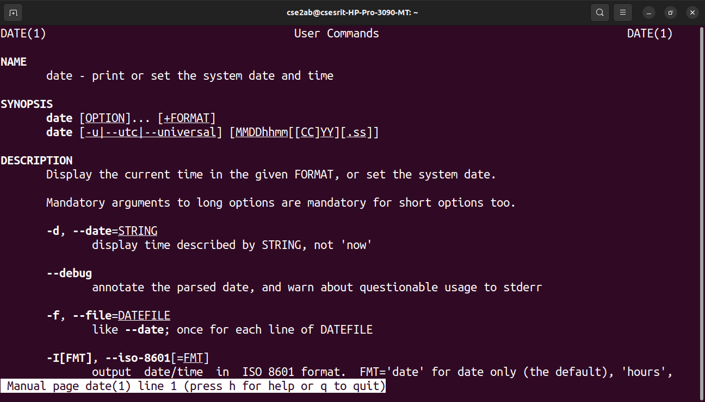
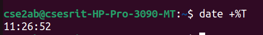
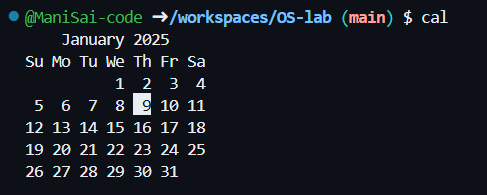
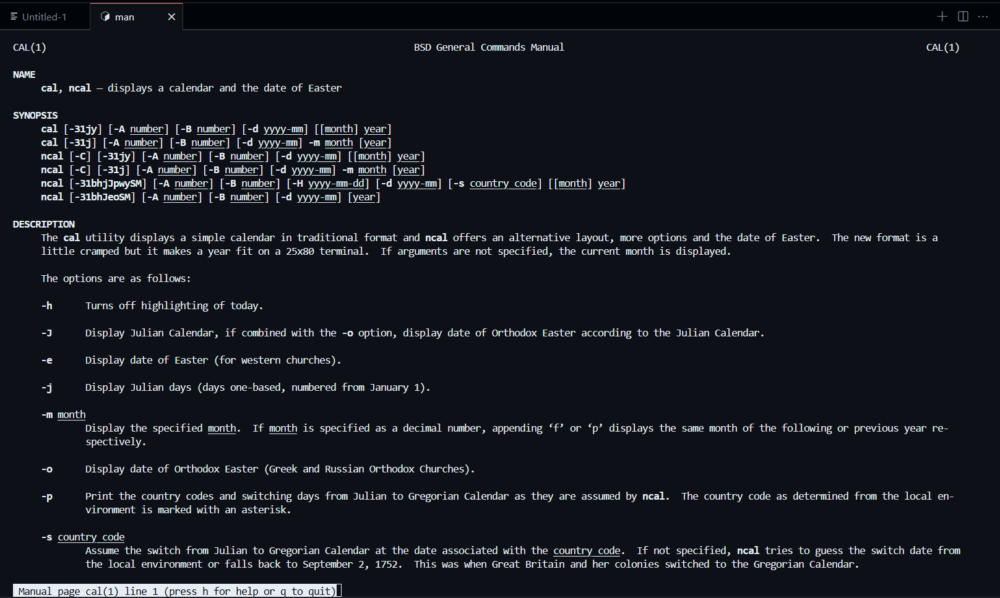
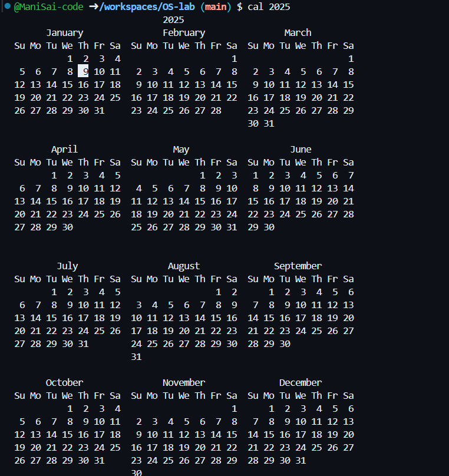
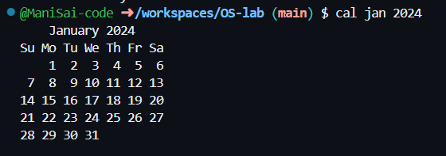
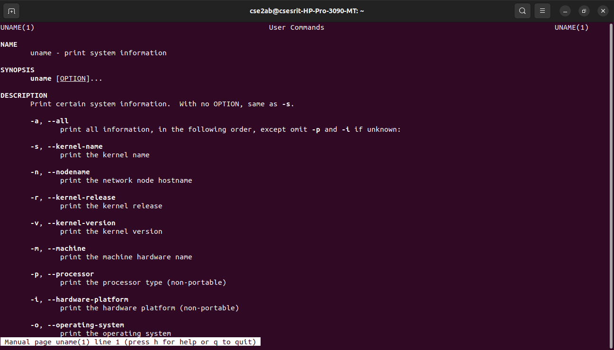
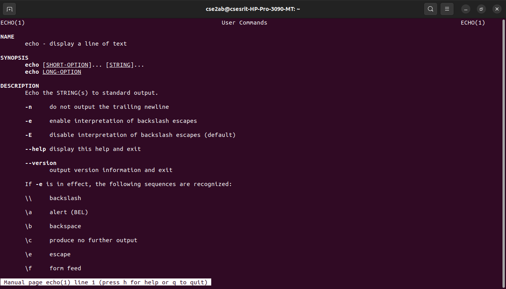

# BASIC UNIX COMMANDS PRACTISE OUTPUT
## GENERAL  COMMANDS OUTPUTS 
### DATE COMMAND OUTPUT
   
### DATE COMMAND MANUAL

### DATE TIME COMMAND OUTPUT

### DATE TIME COMMAND MANUAL

### DATE YEAR COMMAND OUTPUT

### DATE YEAR COMMAND MANUAL

### DATE HOUR COMMAND OUTPUT

### DATE HOUR COMMAND MANUAL

### CAL COMMAND OUTPUT

### CAL COMMAND MANUAL

### CAL-YEAR COMMAND OUTPUT

### CAL-YEAR COMMAND MANUAL

### CAL-MONTH COMMAND OUTPUT

### CAL-MONTH COMMAND MANUAL

### WHO COMMAND OUTPUT 

### WHO COMMAND MANUAL

### WHO AM I COMMAND OUTPUT 

### WHO AM I COMMAND MANUAL

### TTY COMMAND OUTPUT -TERMINAL NAME-

### TTY COMMAND MANUAL

### UNAME COMMAND OUTPUT

### UNAME COMMAND MANUAL

### UNAME-R COMMAND OUTPUT

### UNAME-R COMMAND MANUAL

### UNAME-N COMMAND OUTPUT

### UNAME-N COMMAND MANUAL

### ECHO COMMAND OUTPUT

### ECHO COMMAND MANUAL

