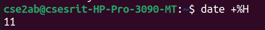

# BASIC UNIX COMMANDS PRACTISE OUTPUT
## GENERAL  COMMANDS OUTPUTS 
### DATE COMMAND OUTPUT
   
### DATE COMMAND MANUAL

### DATE TIME COMMAND OUTPUT

### DATE TIME COMMAND MANUAL

### DATE YEAR COMMAND OUTPUT

### DATE YEAR COMMAND MANUAL

### DATE HOUR COMMAND OUTPUT

### DATE HOUR COMMAND MANUAL

### CAL COMMAND MANUAL

### CAL COMMAND MANUAL

### CAL-YEAR COMMAND MANUAL

### CAL-YEAR COMMAND MANUAL

### CAL-MONTH COMMAND OUTPUT

### CAL-MONTH COMMAND MANUAL

